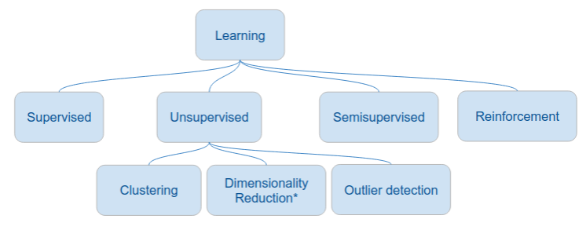

# Team SGD Machine Learning assignment candidates

Topics are based on the learning types.

# Potential topics - Supervised

#### 1. Binary Classification : Predicting Overtaking Difficulty in F1 🚥

- Use data from ErgastAPI (fastf1) - pulls data from the official F1 systems
- Inject weather data?
- Correlate with videos which show overtake or not.

#### 2. Regression Project: Predicting Pit Stop Duration ⏱️

- Goal: Predict the total duration of a pit stop (in seconds) based on pre-stop conditions.
- Correlate with videos which pit stops.

#### 3. Music genre classification + PCA 🎵

- Algos: Random Forest, SVM
- Connects well with PCA to reduce features
- Dataset: https://www.kaggle.com/datasets/carlthome/gtzan-genre-collection

#### 7. Clustering Project: Unsupervised F1 Strategy Analysis 🧩

- Use KNN to identify distinct F1 strategies used by the teams for a race.

~~# Potential topics - UNsupervised~~

~~Use Q-learning and SARSA (algorithms) in the following projects:~~

~~#### 4. Classic cart pole problem _|_~~

~~- add random collisions to the cart~~
~~- inject wind conditions to shift the pole~~
~~- inject gravity variation~~

~~https://gymnasium.farama.org/environments/classic_control/cart_pole/~~

~~#### 5. Humanoid walking 🤖~~

~~Teach a humanoid to walk to a point in a 2D environment.~~
~~- add a marker where the humanoid must walk to~~
~~- inject gravity differentiation~~
~~- add obstacles~~

~~#### 6. Catch the ball with... a twist 🌀~~

~~2D environment in which an agent is trying to learn to catch a ball.~~
~~- add physics~~
~~- inject multiple agents~~
~~- add human player~~

# Team SGD Way of Working - WoW

Thanks for your interest to join team SGD (Stochastic Gradient Descent). Here we'd like to introduce a WoW to avoid future disagreements.

- We write all our content in English.
- Report is writen using LaTeX.
- Collaboration is asynchronous via Github, Google Drive, ...

## Want to collaborate?

Just open a PR with the topic of your interest, or come chat with me at the lectures.
