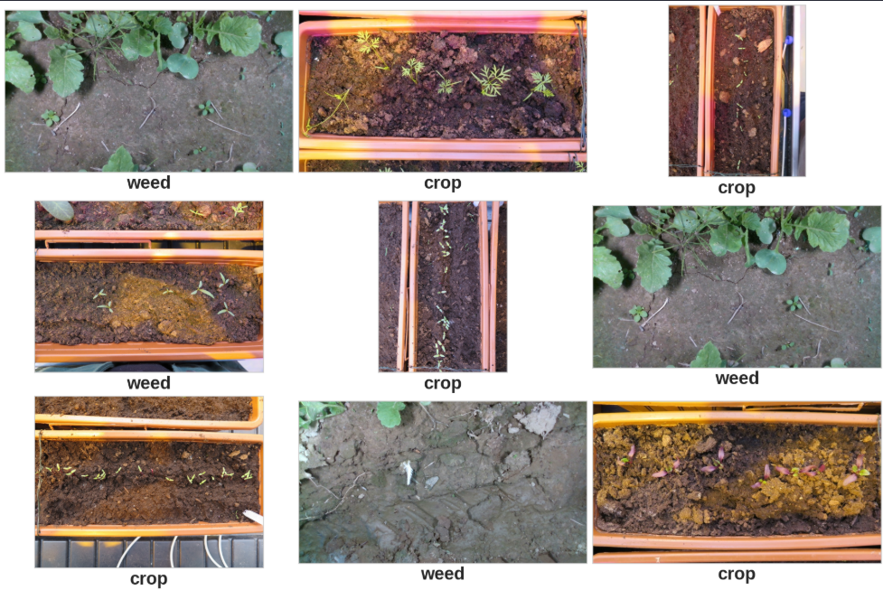
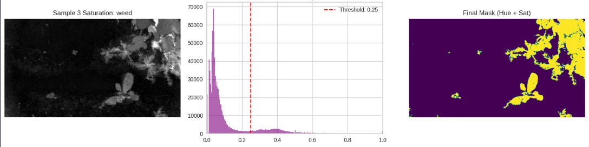
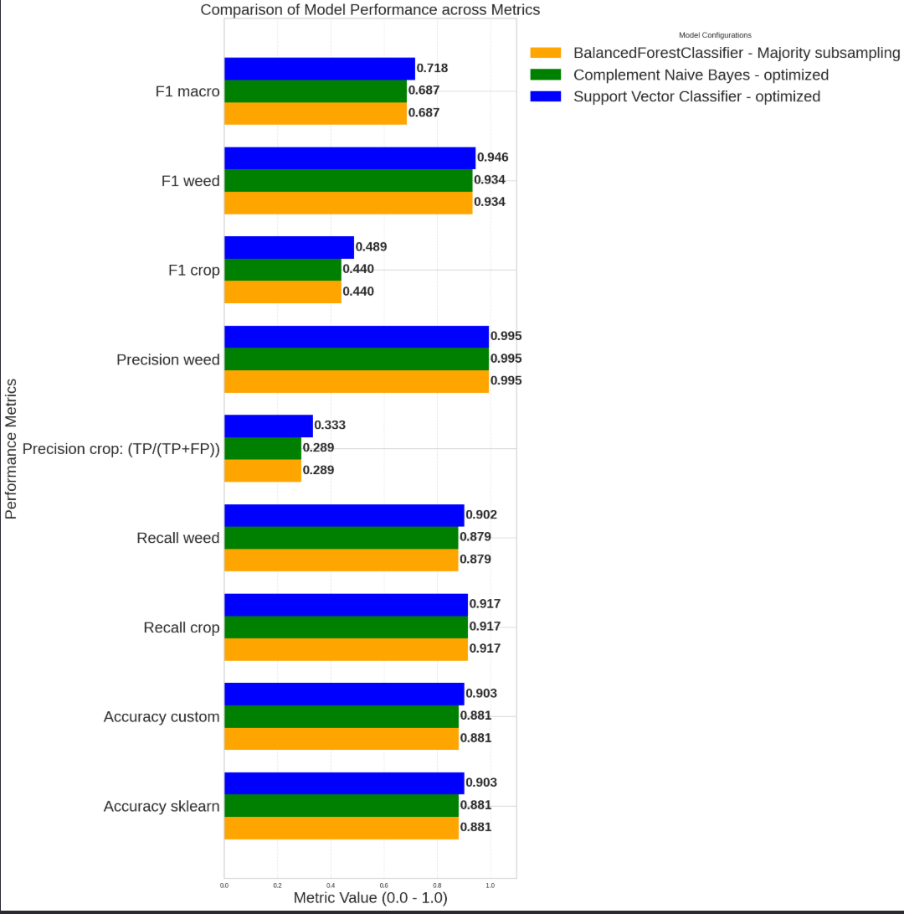

# Weeds & Crops Image Classifier

**MSc in Artificial Intelligence** | **NCSR Demokritos & University of Piraeus**  
**Course:** Machine Learning  
**Student:** Ioannis Petrousov  
**Live Demo:** [https://autofarm.petrousoft.com/](https://autofarm.petrousoft.com/)




## Project research

This research pushes the limits of traditional machine learning and statistical models on high-complexity agricultural image classification under extreme data scarcity. Working with a deliberately small dataset, the pipeline evaluates feature extraction strategies, targeted data augmentation, and systematic hyperparameter tuning to evaluate classical algorithms against modern classification constraints.

Key aspects explored in this research include:
* **Multi-Modal Feature Engineering:** Combining spatial, textural, and color descriptors (**HOG**, **LBP**, and **HSV histograms**).
* **Data Augmentation:** Mitigating small-dataset overfitting through geometric and color transformations.
* **Custom Search Space Optimization:** Hyperparameter tuning tailored to each specific algorithm's search space while respecting optimization constraints.
* **Model Benchmarking:** Comparative performance analysis across various classical algorithms (e.g., SVM, Random Forest, Gradient Boosting, KNN).



## Key Findings & Research Insights

### 1. Research & Exploration
* **Feature Representation Matters Most:** Single feature descriptors suffered in distinguishing weed species from crop leaves possibly due to overlapping shape geometry. Fusing **HOG (shape) + LBP (texture) + HSV (color distribution)** yielded the highest boost in class separation.

* **Color as a Discriminator:** HSV color histograms proved critical in conditions where leaf texture patterns were ambiguous.

* **Small Dataset Regularization:** Hyperparameter tuning heavily favored stronger regularization settings (e.g., higher `C` with strict margins in SVM) to prevent memorization of small sample sizes.


### 2. Experimental Results (Summary)

Below is the relative performance summary across feature extraction methods and optimized models on the test set.




* **Best Performer:** The **SVM with an RBF Kernel** trained on the full concatenated feature vector (**HOG + LBP + HSV**) achieved the highest overall generalizability and F1-score.
* **Impact of Custom Search Tuning:** Custom search space optimization yielded an average performance boost of **+8% to +12% in F1-score** across non-linear models compared to default hyperparameters.


## Repository Structure
```text
├── notebooks/
│   ├── 00_baseline.ipynb       # Research logic and experimental sandbox
│   └── 01_report.ipynb         # End-to-end classification pipeline & RISE Presentation
├── weedcrop/                   # Module Source package
│   ├── autofarm.py             # Core library logic (Extraction, Training, Eval)
│   └── ...
├── requirements.txt            # Pip dependencies
├── environment.yml             # Conda dependencies
└── README.md                   # Repository documentation
```

## Environment Setup

To reproduce the environment, ensure you have Python 3.10+ installed.

1. Clone the Repository

```bash
git clone "[https://github.com/gpetrousov/ml_assignment_demokritos.git](https://github.com/gpetrousov/ml_assignment_demokritos.git)"
cd "ml_assignment_demokritos"
```

2. Set Python Version (Pyenv)

To match the experimental environment, it is recommended to use Python 3.10.13:

```bash
pyenv install 3.10.13
pyenv local 3.10.13
```

3. Install Dependencies (Pip)

```bash
pip install -r "requirements.txt"
```

4. Create and Activate the Conda Environment

```bash
conda env create -f "environment.yml"
conda activate "ml_clean"
```

5. Launch the Notebook(s)

Run the notebook and ensure the ml_clean kernel is selected:

```bash
jupyter notebook notebooks/01_report.ipynb
```

6. Optional: Enable RISE Presentation

If you need to watch the presentation.

```bash
jupyter-nbextension install rise --py --sys-prefix
jupyter-nbextension enable rise --py --sys-prefix
```

## Dataset

If you need to run the notebooks, you need to have the dataset in the root directory of the repo.

- https://datasetninja.com/dataset-of-annotated-food-crops-and-weed-images

```text
@article{SUDARS2020105833,
  title = {Dataset of annotated food crops and weed images for robotic computer vision control},
  journal = {Data in Brief},
  volume = {31},
  pages = {105833},
  year = {2020},
  issn = {2352-3409},
  doi = {[https://doi.org/10.1016/j.dib.2020.105833](https://doi.org/10.1016/j.dib.2020.105833)},
  url = {[https://www.sciencedirect.com/science/article/pii/S2352340920307277](https://www.sciencedirect.com/science/article/pii/S2352340920307277)},
  author = {Kaspars Sudars and Janis Jasko and Ivars Namatevs and Liva Ozola and Niks Badaukis},
}
```
